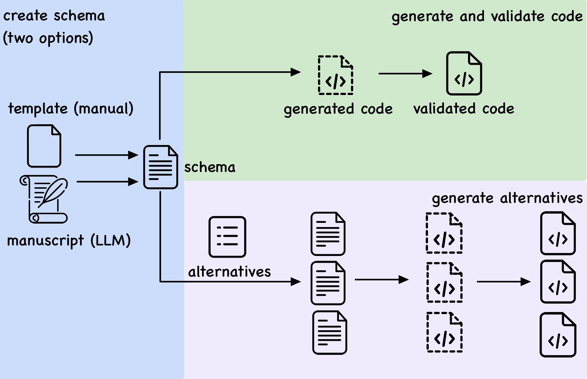

:::column-body

## Research

Statistics has evolved to address complex research questions that often require integrating multiple data sources. This evolution places greater demands on data preparation, exploration, and visualization prior to confirmatory analysis. Modern data analysis also drives the development of statistical software that capable of supporting fast, yet comprehensive, exploratory tasks across diverse data types, including spatial, temporal, imageries, and text data. My research focuses on three areas:

1) understanding, documenting, and extending the decisions made in data analysis, with the help of large language models,
2) exploring and visualizing spatio-temporal data, and
3) interactive graphics for high-dimensional data.


## Decisions in data analysis

Every data analysis is a chain of decisions, from how the data are cleaned to how the model is specified, and each can change the reported result. These decisions are rarely recorded in one place: the code mixes them with implementation details, and the manuscript scatters them across sections or leaves out the ones the authors consider minor. This makes it hard for a reader to understand an analysis, judge whether it is reasonable, or ask how the result would change under a different choice. Large language models (LLMs) open up new ways to study these decisions at scale: extracting them from published papers, recording them in a structured form, and turning them back into code that can be run and compared (@fig-schema-workflow).

```{r fig-schema-workflow, echo = FALSE}
#| fig-align: "center"
#| out-width: 80%
#| lightbox: true
#| fig-cap: "A schema records an analysis as a sequence of decisions in natural language. LLMs generate and validate code from the schema, and an alternative file expands it into a multiverse of analyses."

```

Selected work:

-   **Schemas for documenting and extending data analysis**: a schema that records each decision with its objective and rationale, from which LLMs generate validated code and a multiverse of alternatives. *Under revision.* [](https://github.com/huizezhang-sherry/tines) Example: [schema](schema-example/gaitd-schema.yaml) and the [R script generated from it](schema-example/gaitd-script.R), which reproduces a published GAITD regression.
-   **Inside Out: externalizing assumptions in data analysis as validation checks**. *Journal of Data Science, 2026.* [](https://doi.org/10.6339/25-JDS1206)
-   **An LLM-based pipeline for understanding decision choices from published literature**, applied to air pollution and mortality studies. [](https://github.com/huizezhang-sherry/paper-decisions)

## Spatio-temporal data and glyph maps

Much of the methodological work on multivariate spatio-temporal data focuses on modelling. Before, and alongside, modelling, analysts also need to explore the data: to see how temporal patterns vary across locations, to spot unusual locations or periods, and to check whether the data support a model's assumptions. This requires moving easily between spatial and temporal views of the same data. The glyph map is one visualization that shows both at once, drawing each location's time series as a small plot at its geographic position. @fig-glyphmap-poster traces how my work brings glyph maps into the R ecosystem.

```{r fig-glyphmap-poster, echo = FALSE}
#| fig-align: "center"
#| out-width: 100%
#| lightbox: true
#| fig-cap: "Poster presented at the ENVR Workshop 2026, Houston, Texas: Seeing space and time together: glyph maps in R. [Download the PDF](glyphmap-poster.pdf)."
knitr::include_graphics("glyphmap-poster.webp")
```

Selected work:

-   **cubble**: a data structure for organizing and wrangling multivariate spatio-temporal data, with glyph maps in ggplot2. *Journal of Statistical Software, 2024; ASA [John M. Chambers Statistical Software Award](https://community.amstat.org/jointscsg-section/awards/john-m-chambers).* [](https://doi.org/10.18637/jss.v110.i07) [](https://github.com/huizezhang-sherry/cubble)
-   **sugarglider**: segment and ribbon glyphs for interval data, in ggplot2 and interactive leaflet maps, developed with Maliny Po and Nathan Yang through *Google Summer of Code 2024*, which I co-mentored. *The R Journal, 2026.* [](https://doi.org/10.32614/RJ-2026-050) [](https://github.com/maliny12/sugarglider)
-   **The ggplot2 extension ecosystem**: an overview for users and developers, with Gina Reynolds and Joyce Robbins. *Invited submission to WIREs Computational Statistics, minor revision.* [](https://github.com/jtr13/extensions-review)

<!-- Talks: -->

<!-- -   **Switching between space and time: Spatio-temporal analysis with cubble** -->

<!--     -   **customised glyphmap with German weather stations** Institute for Geoinformatics, University of Münster, Germany May 2023 [](https://sherryzhang-germany2023.netlify.app) -->
<!--     -   **customised glyphmap with Austria weather stations** R Ladies Vienna, Austria Apr 2023 [](https://sherryzhang-rladiesvienna2023.netlify.app) -->
<!--     -   **combined with visual diagnostic** Department of Mathematics and Statistics, Maynooth University, Ireland Apr 2023 [](https://sherryzhang-ireland2023.netlify.app/) -->
<!--     -   **targeted audience in econometrics and statistics** The Australian spatial econometrics and statistics workshop, Melbourne, Australia Feb 2023 [](https://sherryzhang-monashspatial2023.netlify.app/) -->
<!--     -   **People's Choice Award** ECSS Miniconference, virtue Nov 2022 [](https://sherryzhang-ecssmini2022.netlify.app/) -->
<!--     -   **invited talk** CANSSI Ontario Statistical Software Conference, virtue Nov 2022 [](https://sherryzhang-canssi2022.netlify.app/) -->
<!--     -   **workshop style with exercises (spatial, temporal, and spatio-temporal data, cubble, and glyph map)** R Ladies Melbourne, Australia Oct 2022 [](https://sherryzhang-rladiesmelb2022.netlify.app) -->

<!-- -   **Cubble: An R package for organizing and wrangling multivariate spatio-temporal data** UseR! 2022 Jun 2022 [](https://sherryzhang-user2022.netlify.app/) -->

## Interactive graphics for high-dimensional data

High-dimensional data cannot be seen all at once, but they can be explored through a sequence of low-dimensional projections. A tour animates such a sequence, so the viewer can watch the shape of the data change as the projection moves. Projection pursuit guides the tour towards projections that reveal interesting structure, such as clusters or outliers, by optimizing an index function. My work makes these methods easier to diagnose and to use: visualizing how the optimizer searches the space of projections (@fig-diag-plot), measuring how well an index guides the search, and applying tours to understand composite indexes.

```{r fig-diag-plot, echo = FALSE}
#| fig-align: "center"
#| fig-cap: "Search paths of a random search and a pseudo derivative optimiser animated in the basis space of a 5D unit sphere."
knitr::include_graphics("tour.gif")
```

Selected work:

-   **Visual diagnostics for constrained optimisation with application to guided tours** (ferrn). *The R Journal, 2021.* [](https://journal.r-project.org/articles/RJ-2021-105/) [](https://github.com/huizezhang-sherry/ferrn)
-   **Squintability and other metrics for assessing projection pursuit indexes and guiding optimization choices**. *Journal of Computational and Graphical Statistics, 2026.* [](https://doi.org/10.1080/10618600.2026.2614076)
-   **A tidy framework for assembling spatio-temporal indexes from multivariate data** (tidyindex), using tours to explore how an index changes with its weights. *Journal of Computational and Graphical Statistics, 2025.* [](https://doi.org/10.1080/10618600.2024.2374960) [](https://github.com/huizezhang-sherry/tidyindex)
-   Maintainer of the CRAN Task View: [Dynamic Visualizations](https://cran.r-project.org/web/views/DynamicVisualizations.html) (2024–now).

:::
