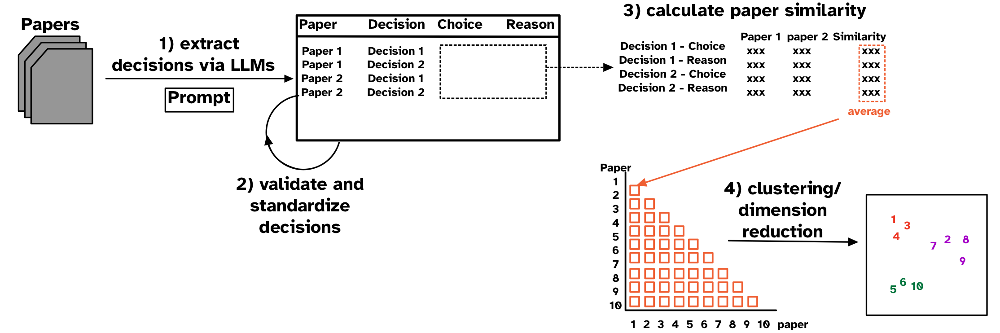
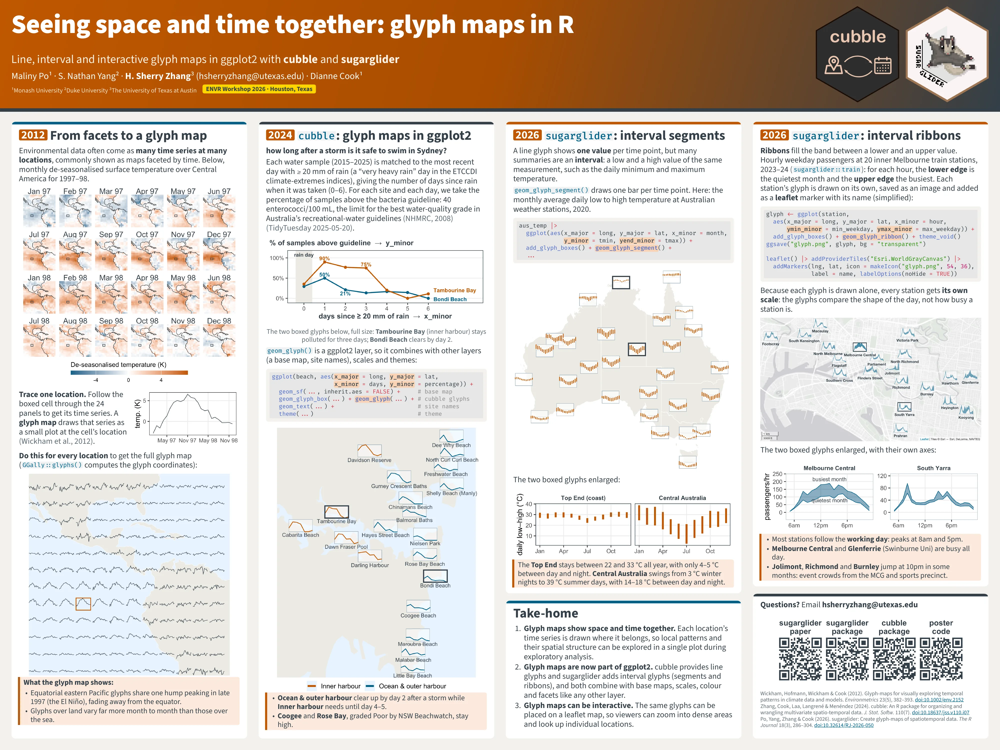
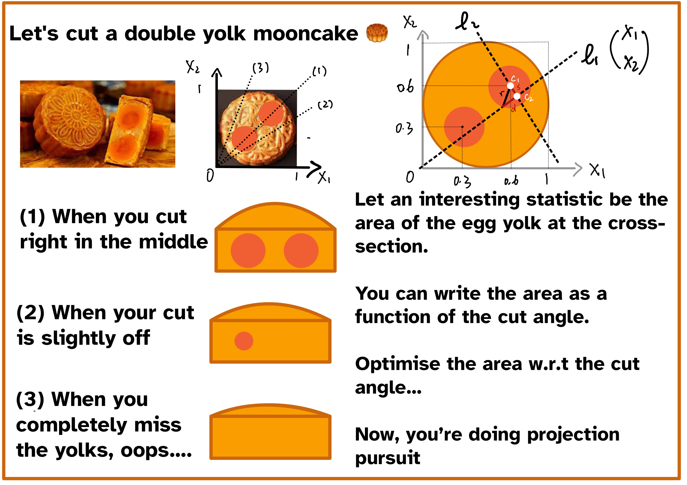
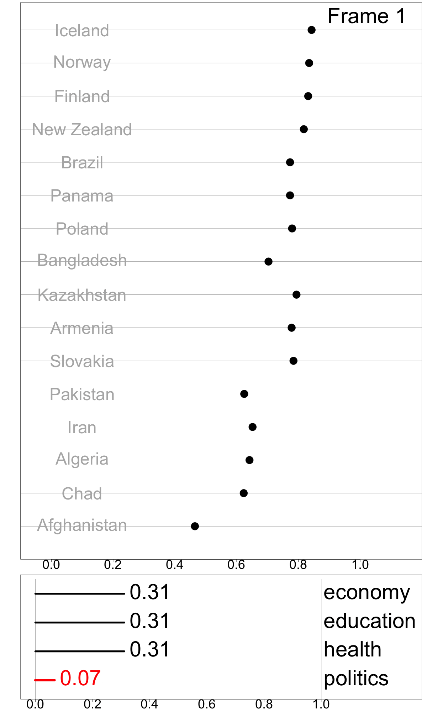

:::column-body

## Research

Statistics has evolved to address complex research questions that often require integrating multiple data sources. This evolution places greater demands on data preparation, exploration, and visualization prior to confirmatory analysis. Modern data analysis also drives the development of statistical software that capable of supporting fast, yet comprehensive, exploratory tasks across diverse data types, including spatial, temporal, imageries, and text data. My research focuses on two main areas:

1) developing methods and software tools for exploring and visualizing multivariate and spatio-temporal data, and
2) building the theoretical foundations for constructing general-purpose tools for practical data analysis.


## An LLM-based pipeline for understanding decision choices in data analysis from published literature

Decision choices, such as those made when building regression models, and their rationale are essential for interpreting results and understanding uncertainty in data analysis. However, these decisions are rarely studied because tracing every alternatives considered by authors is often impractical. Researchers often manually review large bodies of published analyses to identify common choices and understand how these choices are made. In this work, I propose a workflow to automatically extract analytic decisions and their reasons from published literature using Large Language Models. I  also introduce a paper similarity measure based on decision similarity and visualization methods using clustering algorithms. This workflow is applied to understand decision choices in the association of daily particulate matter and daily mortality in air pollution modeling literature. This approach enables scalable and automated studies of decision choices in applied data analysis given the recent advnace of LLMs, providing an alternative to existing qualitative and interview-based studies. *This work is currently under review for 2026 CHI Conference on Human Factors in Computing Systems.*  [](https://github.com/huizezhang-sherry/paper-decisions)

```{r lll-extract-decisions, echo = FALSE}
#| fig-cap: "The workflow for extracting decisions from published literature using Large Language Models (LLMs) and analyzing the extracted decisions. The workflow consists of four main steps: (1) Extract decisions automatically from literature with LLMs, (2) Validate and standardize LLM outputs, (3) Calculate paper similarity and visualization, and (4) Visualize with clustering or dimension reduction methods."

```

## Spatio-temporal data and glyph maps

Much of the methodological work on multivariate spatio-temporal data focuses on modelling. Before, and alongside, modelling, analysts also need to explore the data: to see how the temporal patterns of multiple variables vary across locations, to spot unusual locations or periods, and to check whether the data support the assumptions of a model. This exploration requires moving between spatial and temporal views of the same data, which existing data structures do not make easy. One visualization that shows space and time together is the glyph map, which draws each location's time series as a small plot at its geographic position. @fig-glyphmap-poster traces how my work builds glyph maps into the R ecosystem, from the original glyph map (2012) to cubble (2024) and sugarglider (2026).

```{r fig-glyphmap-poster, echo = FALSE}
#| fig-align: "center"
#| out-width: 100%
#| lightbox: true
#| fig-cap: "Poster presented at the ENVR Workshop 2026, Houston, Texas: Seeing space and time together: glyph maps in R. [Download the PDF](glyphmap-poster.pdf)."

```

The first piece of work is cubble, a new data structure that organizes spatio-temporal data into a spatial and a temporal face, with a suite of functions for switching between them and for slicing and dicing different spatio-temporal components. cubble also implements glyph maps as a ggplot2 extension, `geom_glyph()`, so they can be combined with base maps, scales and themes like any other ggplot2 layer. *This work has been published by Journal of Statistical Software and won the ASA [John M. Chambers Statistical Software Award](https://community.amstat.org/jointscsg-section/awards/john-m-chambers).* [](https://doi.org/10.18637/jss.v110.i07) [](https://github.com/huizezhang-sherry/cubble)

Building on cubble, I co-mentored the *Google Summer of Code 2024* R project with Maliny Po (Monash University) and Nathan Yang (Duke University) to develop `sugarglider`. A line glyph shows one value per time point, but many summaries are an interval, such as the daily minimum and maximum temperature. sugarglider provides functionalities to draw segment and ribbon glyphs to `ggplot2` and interactive leaflet maps. *This work has been published in the R Journal.* [](https://doi.org/10.32614/RJ-2026-050) [](https://github.com/maliny12/sugarglider)

Both cubble and sugarglider are ggplot2 extensions. With Gina Reynolds and Joyce Robbins, I also review the wider ggplot2 extension ecosystem, to help users discover what exists and developers learn how to build their own extensions. *This work is an invited submission to WIREs Computational Statistics (minor revision).* [](https://github.com/jtr13/extensions-review)

<!-- Talks: -->

<!-- -   **Switching between space and time: Spatio-temporal analysis with cubble** -->

<!--     -   **customised glyphmap with German weather stations** Institute for Geoinformatics, University of Münster, Germany May 2023 [](https://sherryzhang-germany2023.netlify.app) -->
<!--     -   **customised glyphmap with Austria weather stations** R Ladies Vienna, Austria Apr 2023 [](https://sherryzhang-rladiesvienna2023.netlify.app) -->
<!--     -   **combined with visual diagnostic** Department of Mathematics and Statistics, Maynooth University, Ireland Apr 2023 [](https://sherryzhang-ireland2023.netlify.app/) -->
<!--     -   **targeted audience in econometrics and statistics** The Australian spatial econometrics and statistics workshop, Melbourne, Australia Feb 2023 [](https://sherryzhang-monashspatial2023.netlify.app/) -->
<!--     -   **People's Choice Award** ECSS Miniconference, virtue Nov 2022 [](https://sherryzhang-ecssmini2022.netlify.app/) -->
<!--     -   **invited talk** CANSSI Ontario Statistical Software Conference, virtue Nov 2022 [](https://sherryzhang-canssi2022.netlify.app/) -->
<!--     -   **workshop style with exercises (spatial, temporal, and spatio-temporal data, cubble, and glyph map)** R Ladies Melbourne, Australia Oct 2022 [](https://sherryzhang-rladiesmelb2022.netlify.app) -->

<!-- -   **Cubble: An R package for organizing and wrangling multivariate spatio-temporal data** UseR! 2022 Jun 2022 [](https://sherryzhang-user2022.netlify.app/) -->

## Interactive graphics for high-dimensional data

Projection pursuit is a technique used to find interesting low-dimensional linear projections of high dimension data by optimizing an index function on projection matrices. The index function could be non-linear, computationally expensive to calculate the gradient, and may have local optima, which are also interesting for projection pursuit to explore. This work has designed four diagnostic plots to visualize the optimisation routine in projection pursuit, and @fig-diag-plot is one of them, plotting two optimisation paths in a 5D unit sphere space. *This work has been published in the R Journal.* [](https://journal.r-project.org/articles/RJ-2021-105/) [](https://github.com/huizezhang-sherry/ferrn)

<!-- Talk: **Visual diagnostics for constrained optimisation with application to guided tours**: UseR! 2021 July 2021 [](https://sherryzhang-user2021.netlify.app/) -->

<!-- I don't expect what I just said to fully make sense to you, so let's instead think about cutting double yolk mooncake: -->

<!-- ```{r echo = FALSE} -->
<!--  -->
<!-- ``` -->

<!-- I hope you can see that the index function can become quiet complex if the data dimension increases. In fact, t -->


```{r fig-diag-plot, echo = FALSE}
#| fig-cap: "Search paths of a random search and a pseudo derivative optimiser animated in the basis space of a 5D unit sphere."
knitr::include_graphics("tour.gif")
```

Following on from these diagnostics, I developed squintability and other metrics for assessing projection pursuit indexes, which help guide the choice of optimiser and its settings. *This work has been published in Journal of Computational and Graphical Statistics.* [](https://doi.org/10.1080/10618600.2026.2614076)

Indexes are useful for summarizing multivariate information into a single metric for monitoring, communicating, and decision-making. While most work has focused on defining new indexes for specific purposes, most indexes are not designed and implemented in a way that makes it easy to understand index behavior in different data conditions, and to determine how their structure affects their values and variation in values. I developed a modular data pipeline recommendation to assemble indexes, and it allows investigation of index behavior as part of the development procedure. One can compute indexes with different parameter choices, adjust steps in the index definition by adding, removing, and swapping them to experiment with various index designs, calculate uncertainty measures, and assess indexes' robustness. @fig-idx-tour shows the Global Gender Gap Index, comprised of four dimensions (economy, education, health, and politics) in a linear combination with equal weights of 0.25. The tour animation, built on the same tour methods, shows how the index value and country ranking changes as the weight assigned to the politics dimension changes. *This work has been published in Journal of Computational and Graphical Statistics.* [](https://doi.org/10.1080/10618600.2024.2374960) [](https://github.com/huizezhang-sherry/tidyindex)

```{r fig-idx-tour, echo = FALSE}
#| fig-cap: "Exploring the sensitivity of the Global Gender Gap Index (GGGI), by varying the politics component’s contribution. Bangladesh’s GGGI increases substantially when politics gains more weights, indicating that this component plays a large role in it’s relatively high value. Also, politics plays a substantial role in the GGGI’s for the top ranked countries, because each of them drops, to the state of being similar to the middle ranked countries when the politics component’s contribution is reduced."
#| out-width: 50%


```

I am also a maintainer of the CRAN Task View: [Dynamic Visualizations](https://cran.r-project.org/web/views/DynamicVisualizations.html) (2024–now).


:::
